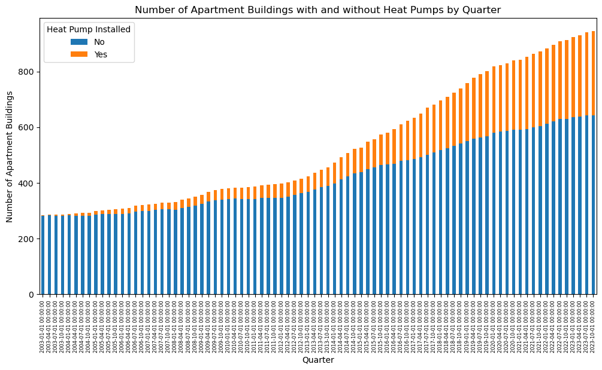
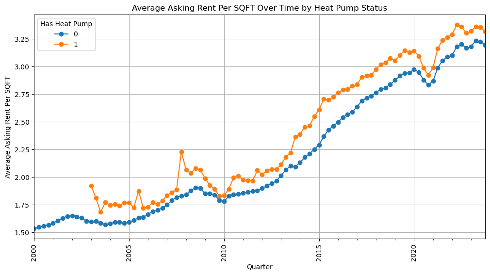
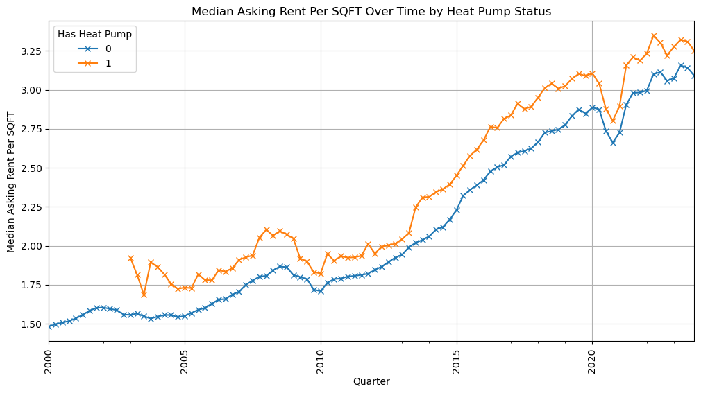
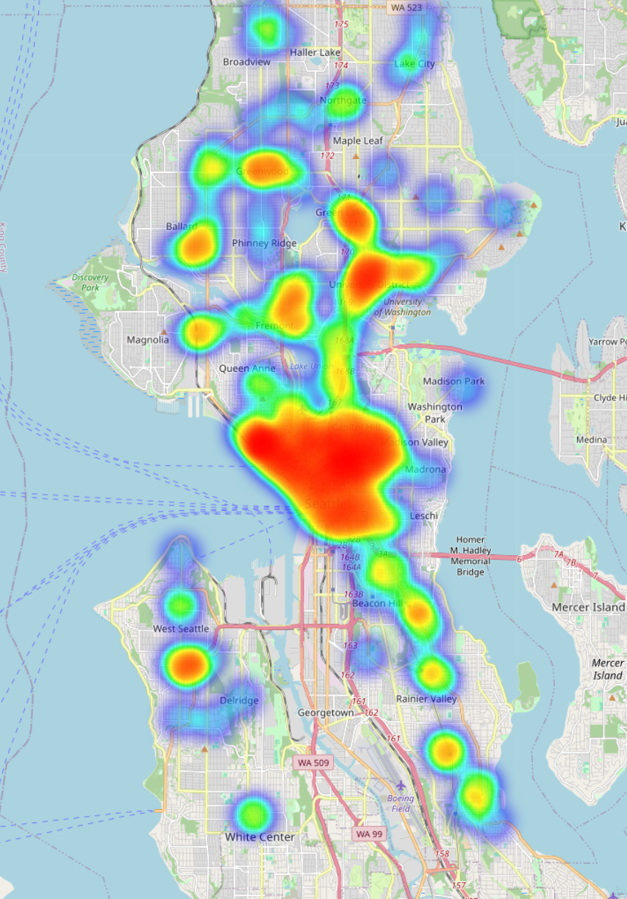

Figure 1: Total Class A and Class B Apartment Buildings with and without Heat Pump

Figure 2: Average Asking Rent Over Time by Heat Pump Status

Figure 3: Median Asking Rent Over Time by Heat Pump Status

Figure 4: Heat Map of Apartment Buildings with Heat Pump Installed

Figure 5: Heat Pump Installation Ratio by Census Tract

Figure 6: Asking Rent Over Time by Heat Pump Status and Building Classes

Figure 7: Heat Pump Coverage Status Over Time (Classified Using Semi-Supervised Machine Learning Technique)

Figure 8: Average Effective Rent by Heat Pump Coverage Status Over Time (Classified Using Semi-Supervised Machine Learning Technique)

