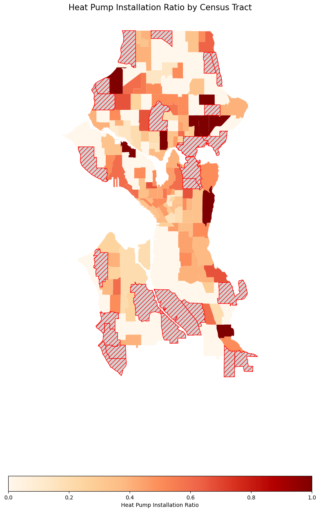
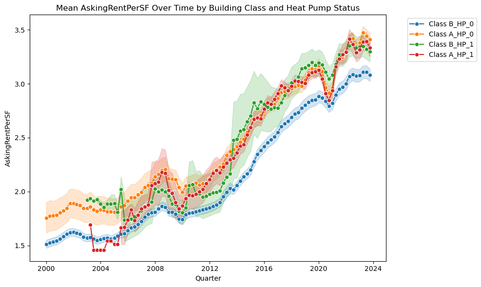
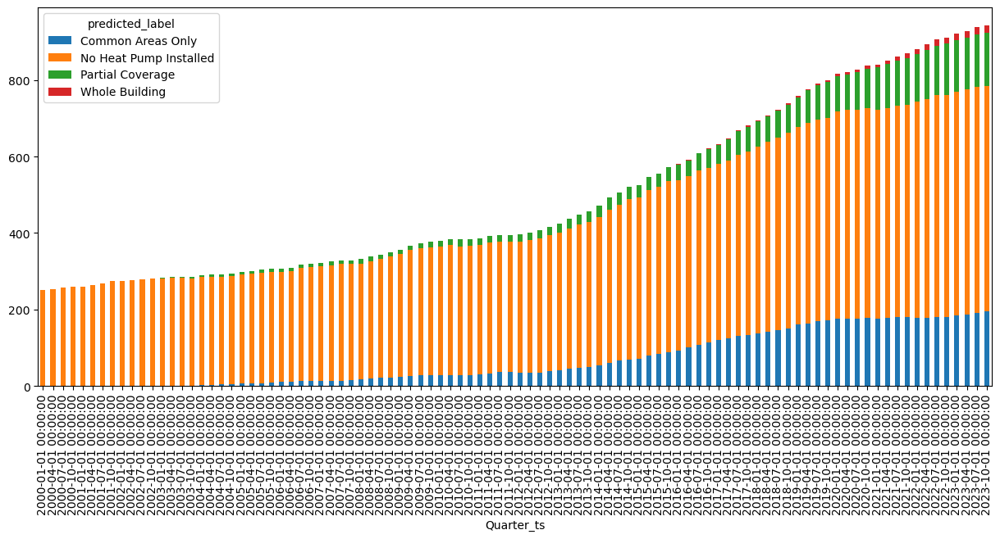
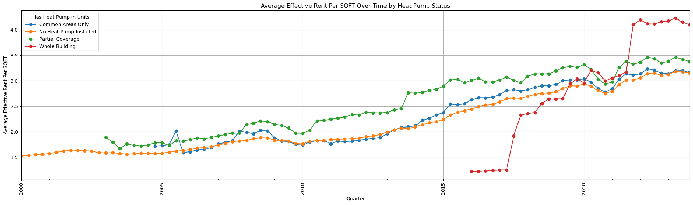

> Figure 1: Total Class A and Class B Apartment Buildings with and
> without Heat Pump
>
> {width="6.5in" height="4.0in"}
>
> Figure 2: Average Asking Rent Over Time by Heat Pump Status
>
> {width="6.5in"
> height="3.6527777777777777in"}
>
> Figure 3: Median Asking Rent Over Time by Heat Pump Status
>
> {width="6.5in"
> height="3.6527777777777777in"}
>
> Figure 4: Heat Map of Apartment Buildings with Heat Pump Installed
>
> {width="4.286458880139983in"
> height="6.132451881014873in"}
>
> Figure 5: Heat Pump Installation Ratio by Census Tract

- {width="6.5in" height="10.375in"}

> Figure 6: Asking Rent Over Time by Heat Pump Status and Building
> Classes
>
> {width="6.5in"
> height="3.888888888888889in"}

Figure 7: Heat Pump Coverage Status Over Time (Classified Using
Semi-Supervised Machine Learning Technique)

{width="6.5in" height="3.513888888888889in"}

Figure 8: Average Effective Rent by Heat Pump Coverage Status Over Time
(Classified Using Semi-Supervised Machine Learning Technique)

{width="6.5in"
height="1.9305555555555556in"}

'
